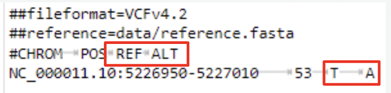

# Single Nucleotide Variant Caller (SNVC) 

SNVC is a python package similar to VarScan that accepts aligned sequence data in BAM/Mpileup format and will analyze the read alignments to pinpoint regions where there are substitutions compared to the reference genome. It will generate an output file (VCF format) with the substitution and where it occurred in the genome (chromosome number, genomic coordinates). 

# Dependencies Needed

Note: We assume you already have python3 installed since these installations require python. You can check if you have python3 installed by doing ```python3 --version```. Please install python3 on your laptop if you haven't already. Another way to run this tool  would be on Juypter Notebook terminal. 

For Mac users: if you don't already have brew installed please install it using ``` /bin/bash -c "$(curl -fsSL https://raw.githubusercontent.com/Homebrew/install/HEAD/install.sh)" ``` and follow the instructions in the script. You can check if brew is installed by running this command ``` brew --version ```. 

SNVC requires the following tools to be installed: 

  1. ```samtools```

  2. ```bwa```
     
  3. ```matploblib```

To install these tools please run the following commands: 

``` brew install samtools ```

``` brew install bwa ```

``` pip3 install pysam ```

```python3 -m pip install matplotlib ```

Once you have installed python3 on your laptop and installed the brew commmand, please install 

# Installation Instructions

Step 1: Clone our github repository and cd into the directory

``` git clone https://github.com/archxta/cse185_project ```

``` cd cse185_project ```

Step 2: Run our setup script in your terminal to generate the BAM files (Note: ignore any error generated by this command, it should still create the BAM files successfully)

```bash setup.sh```

We have now generated the BAM files with aligned sequenced reads that are sorted and indexed. We will use these BAM files to identify single nucleotide substitutions using our tool, SNVC. 

# Basic Usage

THe basic usage of SNVC is: 

``` python3 code.py variantdataset.fasta alignedreads.bam output.vcf ```

## Testing SNVC 

To run SNVC on our test datasets (see data folder), run the following commands

```python3 code.py data/reference.fasta data/variant1.fasta data/sorted_aligned1_reads.bam results/output1.vcf```

```python3 code.py data/reference.fasta data/variant2.fasta data/sorted_aligned2_reads.bam results/output2.vcf```

```python3 code.py data/reference.fasta data/variant3.fasta data/sorted_aligned3_reads.bam results/output3.vcf```

This should have generated the final VCF file which contains information about the genetic variants detected in our DNA sequencing data that we obtained from a sickle cell mutation on the HBB gene. You can view the VCF file contents using the ```cat``` command followed by the filepath and filename (ex. ```cat results/output1.vcf```. Here is a sample VCF file output for one of our datasets: 



From this output, we can see that that there is a variant at position 53 within this region where the reference 'T' is substituted with an 'A'. 
